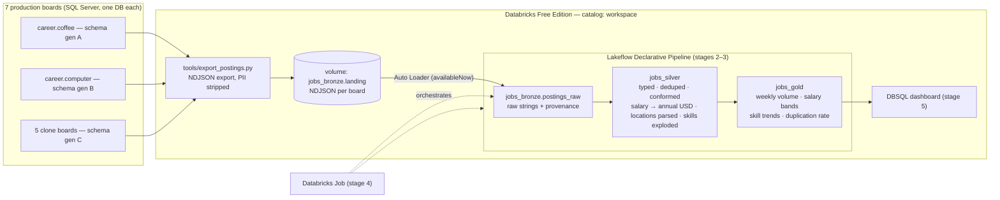

# jobs-lakehouse

A Databricks lakehouse over **109,259 real job postings** from seven
production job boards I run (career.coffee, .computer, .solar, .pet,
.delivery, .church, .dental) — built end to end on **Databricks Free
Edition**, designed to be reproducible by anyone with a fresh free account
and the committed sample data.

The point of the project is the mess. The seven boards are real systems
built at different times, so they disagree about everything: three different
database schemas, int-coded vs string-coded enums, 37 currencies with a
lying default, 120+ raw spellings of "full-time", locations as free text,
and postings cross-posted between boards under different ids. The pipeline's
job is to turn that into trustworthy analytics — and every layer exists to
solve a specific, measured problem listed below.

Companion doc: **[LEARNING.md](LEARNING.md)** — the Databricks concepts this
project exercises, written as study notes, not marketing.

## Architecture



| Layer | What it does | Why it exists | Status |
|---|---|---|---|
| **Landing** (UC volume) | Per-board NDJSON export files | Free Edition restricts outbound network, so extraction runs outside and files arrive here; the volume makes the handoff *governed* | ✅ built |
| **Bronze** (`jobs_bronze.postings_raw`) | Auto Loader ingests new files exactly-once; everything kept as strings + provenance columns | Replayability: when a silver rule changes, we replay from here instead of re-exporting 7 production DBs | ✅ built |
| **Silver** (`jobs_silver.*`) | Types, conforms 3 schema generations, dedupes reposts + cross-board duplicates, normalises salary to annual USD, parses locations, explodes skills; expectations on every table | One row = one real-world posting; all interpretation happens here, versioned and tested | 🔜 stage 2 |
| **Gold** (`jobs_gold.*`) | Postings/vertical/week · salary bands by role/seniority/geo · skill frequency+trend · cross-board duplication rate | Shaped for the dashboard; rebuilt from silver at will | 🔜 stage 3 |
| **Job** | Bronze ingest task → pipeline update task | One schedule, one DAG, ≤ 5 concurrent tasks (Free Edition cap) | 🔜 stage 4 |
| **Dashboard** (DBSQL) | One dashboard over gold on the 2X-Small warehouse | The consumption story | 🔜 stage 5 |

## The data (measured, not invented)

Full export: 109,259 postings (68 MB NDJSON, not committed). Committed
samples: 3,235 postings (every-Nth stratified per board, ~1.8 MB) so a
stranger can run the whole pipeline.

| board | rows | schema gen | salary amounts | notes |
|---|---:|---|---:|---|
| career.coffee | 43,859 | A — int enums, parsed geo, JSON-in-string skills | 5,293 (12%) | history since 2024-02; 37 currencies |
| career.computer | 40,258 | B — string enums, parsed geo, tag tables | 3,216 (8%) | 120+ raw `JobType` spellings |
| career.solar | 14,365 | C — string enums, free-text location only | 1,070 (7%) | richest tags (51k tag links) |
| career.pet | 5,754 | C | 0 | `JobType` 100% null |
| career.dental | 3,741 | C | 17 | |
| career.delivery | 1,047 | C | 0 | |
| career.church | 235 | C | 0 | |

### The mess catalog — what each layer must survive

| # | Real, measured mess | Where handled | How |
|---|---|---|---|
| 1 | **Three schema generations**: same concept, different columns (`EmploymentType` int vs `JobType` string; `CreatedAt` vs `PostedAt`; parsed geo vs free text) | Bronze unions, Silver conforms | one ragged bronze table; per-generation mapping in silver |
| 2 | **Enums as ints** on coffee (`RoleType`=0..20) vs **raw scraped strings** on the rest (`CDI`, `Ausbildung`, `正社員`, `Full-time`/`FullTime`/`Full Time`) | Silver | decode tables from `src/coffee_enums.py` + string conformance map with an explicit `other` bucket |
| 3 | **Lying currency default**: coffee stamps `USD/yearly` on every row — 12,730 "USD yearly" rows, only 1,256 with actual amounts | Silver | trust rules: currency believed only alongside amounts / corroborating geo |
| 4 | **Missing pay period**: e.g. 609 computer rows with `EUR` amounts and NULL period | Silver | magnitude-based period inference with an explicit confidence flag |
| 5 | **37 currencies** across boards | Silver | pinned FX table → annual USD (`src/config.py`) |
| 6 | **Free-text locations only** on 5 of 7 boards ("Edmond, OK", "名古屋市", "Remote (EU)") | Silver | location parser → country / city / remote flag |
| 7 | **Cross-board duplicates**: 303 computer↔solar + 198 coffee↔computer share the exact `SourceUrl`; more overlap by title+company | Silver dedupe, Gold metric | SourceUrl exact match + normalised fingerprint; duplication-rate mart |
| 8 | **Intra-board reposts**: ~3,000 same-title-same-company groups on each big board | Silver | latest-wins survivorship by (board, id) and fingerprint |
| 9 | **Skills in three encodings**: JSON-array-serialised-into-a-string (coffee ORM), tag tables folded to arrays (computer/solar), absent (pet/delivery/church) | Silver | double-parse / explode into one skills table |
| 10 | **Sparse salaries** (0–12% coverage by board) | Gold | salary marts report coverage alongside bands — the gap is itself a finding |
| 11 | **Timestamp artifacts**: midnight-truncated `PostedAt`, mixed date conventions | Silver | documented casting rules |
| 12 | **U+2028 in a title** breaking NDJSON (JSON-legal, line-fatal) | Export | scrubbed in SQL; validator splits on `\n` only — see `tools/sql/*.sql` |

## Free Edition constraints → design consequences

Verified against the [Free Edition limitations](https://docs.databricks.com/aws/en/getting-started/free-edition-limitations)
docs, 2026-08 — these change; re-check before copying this design.

| Constraint | Consequence here |
|---|---|
| Serverless compute only; Python + SQL only | No cluster config anywhere; everything runs on serverless notebooks/pipelines |
| Streaming: only `Trigger.AvailableNow` (continuous triggers throw) | Bronze is incremental-batch by design; "continuous enough" = scheduled drains |
| Restricted outbound network | Extraction runs on the data owner's machine; the workspace only sees the landing volume |
| One active Lakeflow pipeline per type | Silver AND gold live in ONE pipeline (also the honest design: one DAG) |
| Max 5 concurrent job tasks | The job needs 2 sequential tasks — comfortably inside |
| One SQL warehouse, 2X-Small | Gold is pre-aggregated so the dashboard is cheap; auto-stop on |
| Daily fair-use quota; overage stops compute for the day | Small data on purpose: full dataset is 68 MB; every run is minutes |

## Run it yourself (fresh Free Edition account)

1. **Get a workspace**: sign up at [databricks.com/learn/free-edition](https://www.databricks.com/learn/free-edition) (email OTP or Google/Microsoft sign-in).
2. **Bring the repo in**: Workspace → Create → **Git folder** → paste this repo's GitHub URL (public repos clone without credentials).
3. **Run `notebooks/00_setup_unity_catalog`** (open it, "Run all" — serverless compute attaches automatically). Creates schemas + volumes, all commented. Then take the Catalog Explorer tour the notebook suggests.
4. **Run `notebooks/01_load_landing`** with the `subset` widget on `first-half`. Copies 4 boards' sample files into the landing volume.
5. **Run `notebooks/02_bronze_autoloader`**. Watch it ingest ~2,250 rows, then read the verify cells — the three-schemas-one-table raggedness is the exhibit.
6. **Prove exactly-once**: run the write cell again → 0 rows ingested, no new commit in the history cell.
7. **Prove incrementality**: re-run 01 with `subset=all` (adds 3 boards), re-run 02 → only the new files' ~985 rows are ingested.
8. *(Data owner only)* Full dataset: `python3 tools/export_postings.py --run` locally (needs `MSSQL_*` env vars + `brew install sqlcmd`), then upload `data/exports/<board>/*.ndjson` into `landing/<board>/` via the volume's Upload button and re-run 02.

## Design decisions I expect to defend

**Why is bronze a notebook + Auto Loader instead of living inside the
Lakeflow pipeline?** Pedagogy over purity, and I'll say so: hand-rolling
bronze teaches what the checkpoint, schema history and `_rescued_data`
actually are, so the pipeline's streaming tables (stage 2) aren't magic. In
production I'd put bronze in the same pipeline as a streaming table — one
DAG, one lineage graph — and the migration is mechanical
(`readStream` → `@table`).

**Why one bronze table for three schemas instead of a table per source?**
The boards are one *domain* with one downstream consumer; a table per
generation just moves the union into silver while tripling the ingest
surface. The union costs nothing (ragged columns are NULL), and
`schema_gen` keeps every row's dialect queryable.

**Why strings-only bronze?** A cast is an interpretation, and bronze's
contract is "no interpretations." A wrong type inferred at ingest is baked
into the table; the same cast in silver is a re-run. It also sidesteps
cross-file type-conflict rescues for data this heterogeneous.

**Why `availableNow` instead of a continuous stream?** Serverless forbids
continuous triggers — but I'd choose this anyway: job postings change daily,
and a 24/7 stream would be paying for latency nobody consumes. Streaming
checkpoints + scheduled drains = incremental correctness at batch cost.

**Why does extraction run outside Databricks?** Free Edition restricts
outbound network, but the deeper reason: the export needs production DB
credentials, and I want those nowhere near the analytics platform. The
landing volume is the interface; either side can change independently.

**Why keep expired/closed postings?** Gold's weekly trends need history —
coffee's data reaches back to 2024-02. Status is data, not a filter, until
silver decides per-use-case.

**Why no partitioning on bronze?** 109k rows is ~2 file-groups of Delta.
Partitioning below tens of GB manufactures small files and slows everything;
Delta's per-file stats already give board-level skipping. (If this grew:
liquid clustering on `board`, not directory partitioning.)

**Why commit sample data to a portfolio repo?** "A stranger with a fresh
account can run it end to end" is a requirement; a stranger has no access to
my databases. 3,235 stratified real rows keep every category of mess
present at demo scale, and the PII policy below makes them publishable.

## Data ethics / PII

These are public job postings scraped from public ATS pages, aggregated by
boards I operate. The export **selects fields, not rows**: no description
text (it embeds contact emails), no contact email/phone columns, no
application URLs/emails, no user data of any kind. A validator additionally
redacts email-shaped strings anywhere outside `SourceUrl`
(`tools/export_postings.py --check`). The repo contains no credentials and
no workspace URLs; full exports stay untracked (`data/exports/` is
gitignored).

## Repo map

```
├── README.md · LEARNING.md          you are here / study notes
├── src/
│   ├── config.py                    all names, paths, FX + period constants
│   └── coffee_enums.py              int→name decode maps for the gen-A board
├── tools/
│   ├── export_postings.py           data-owner export runner + validator + sampler
│   └── sql/                         the three per-generation export queries
├── data/
│   ├── samples/                     committed: 3,235 real postings (7 boards)
│   └── exports/                     gitignored: full exports land here
├── notebooks/
│   ├── 00_setup_unity_catalog.py    schemas + volumes, commented
│   ├── 01_load_landing.py           samples → landing volume (incremental demo)
│   └── 02_bronze_autoloader.py      Auto Loader → bronze, verified + documented
├── pipelines/                       stage 2–3: Lakeflow pipeline source
└── docs/screenshots/                captured evidence (Free Edition isn't always-on)
```

## Build stages

| stage | deliverable | status |
|---|---|---|
| 1 | Export tooling, samples, UC setup, Bronze via Auto Loader | ✅ this commit |
| 2 | Silver in a Lakeflow Declarative Pipeline, expectations incl. drop + fail demos | 🔜 |
| 3 | Gold marts in the same pipeline | 🔜 |
| 4 | Scheduled Databricks Job | 🔜 |
| 5 | DBSQL dashboard + screenshots + final docs | 🔜 |
